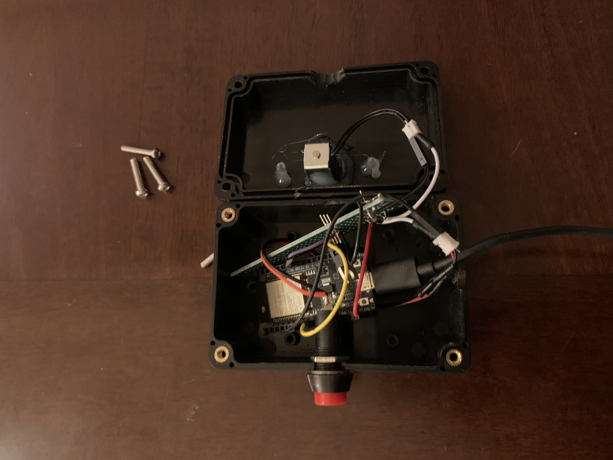

# xylophone

## getting started

- flash xylophone.ino script onto ESP32
- construct circuit according to diagram below
- power on esp and begin playing with the key!

## circuit diagram

## photos

## video

